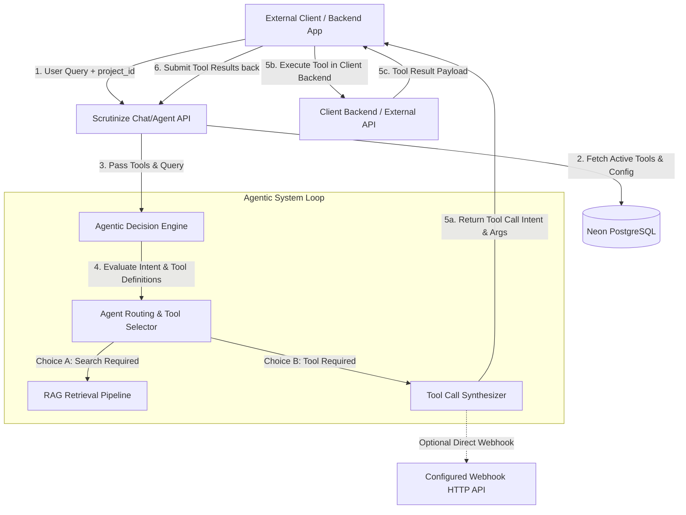

# Architecture Decision Record: Dynamic Custom Tooling & Agentic Engine

* **Status:** Proposed
* **Date:** 2026-08-10
* **Author:** Antigravity AI
* **File Reference:** [003_ADR_custom_tooling.md](file:///c:/Programming/Projects/01_ACTIVE/ai_news/Scrutinize/docs/decisions/003_ADR_custom_tooling.md)

---

## Context & Problem Statement

Currently, Scrutinize operates primarily as a retrieval-augmented generation (RAG) search pipeline (v2), capable of querying project-specific vector stores and synthesizing contextual answers. While effective for passive knowledge lookup, modern workflows require **agentic decision-making**—the ability for an LLM to actively decide *when* and *how* to execute custom tools, invoke external service APIs, or trigger business logic based on natural language user queries.

To transform Scrutinize into a full-fledged **Agentic System**, we need a project-level tool definition and orchestration engine with the following constraints:
1. **Project-Scoped Custom Tools:** Project owners must be able to define, configure, enable, or disable custom tools per project via the UI or REST API.
2. **Dynamic Tool Choice & Intent Resolution:** Based on the user query, system prompt, and context, the agent must autonomously decide whether standard RAG, a specific tool, or a combination of tool calls is required.
3. **Decoupled Execution Model (Client Backend Execution):** The actual code execution of custom tools should preferably reside in the external caller application's backend. Scrutinize acts as the central **Intelligent Agent Engine**, identifying which tool to call and compiling the JSON argument payloads, returning the tool invocation instructions to the calling app API. Optionally, direct webhook invocation by Scrutinize will also be supported for server-side tools.
4. **API-First Architecture:** External backend applications invoking Scrutinize via API must be able to exchange tool call requests and tool execution results seamlessly in a standard agentic conversation loop.

---

## High-Level Architecture

We introduce a **Dynamic Tooling & Agentic Orchestration Layer** to the existing Scrutinize pipeline.



---

## Core Pillars of Design

In accordance with our core engineering principles, this design adheres strictly to the three pillars of clean software construction:

### 1. Modularity
* **Isolated Tool Definition Module:** Tool schemas, parameter specifications, and execution policies are stored independently of agent reasoning logic.
* **Pluggable Tool Execution Handlers:** Scrutinize decouples *tool selection reasoning* from *tool execution execution*, treating `ClientExecution` and `ServerWebhook` as interchangeable runtime handlers.
* **Independent Conversation State:** Tool call history, function arguments, and execution outputs follow OpenAPI / OpenAI compatible function calling standards, keeping the pipeline stateless and context-transparent.

### 2. Scalability
* **Stateless Agent Processing:** The Agent Decision Engine evaluates queries and formats tool call schemas without holding blocking thread states or maintaining long-lived connection locks.
* **Cached Tool Registry:** Active project tools and JSON schemas are cached (e.g. in Redis / in-memory LRU) per project ID to minimize PostgreSQL lookup overhead on hot conversational endpoints.
* **Non-blocking API Loop:** Asynchronous tool resolution ensures high throughput even under heavy query volume across hundreds of tenant projects.

### 3. Flexibility
* **Multi-Execution Modes:** Supports both **Client-Side Execution** (Scrutinize returns tool invocation directives for client backends to run) and **Server-Side Webhooks** (Scrutinize directly dispatches HTTP requests).
* **Dynamic Parameter Validation:** Tool inputs are defined via standard [JSON Schema](https://json-schema.org/), enabling standard validation, automatic UI form rendering, and LLM prompt serialization without changing core code.
* **Granular Project Controls:** Enable/disable individual tools dynamically per project without altering application code or requiring pipeline deployments.

---

## Data Model & Database Schemas

To manage tools per project, a new set of tables will be added to the Neon PostgreSQL database:

```sql
-- Custom Tool Schema Table
CREATE TABLE project_tools (
    id UUID PRIMARY KEY DEFAULT gen_random_uuid(),
    project_id UUID NOT NULL REFERENCES projects(id) ON DELETE CASCADE,
    name VARCHAR(64) NOT NULL,
    display_name VARCHAR(128) NOT NULL,
    description TEXT NOT NULL,
    is_enabled BOOLEAN NOT NULL DEFAULT TRUE,
    
    -- Execution Mode: 'client_delegated' (caller executes) or 'server_webhook' (Scrutinize executes HTTP webhook)
    execution_mode VARCHAR(32) NOT NULL DEFAULT 'client_delegated',
    
    -- For 'server_webhook' mode
    webhook_url TEXT NULL,
    webhook_method VARCHAR(10) NULL DEFAULT 'POST',
    webhook_headers JSONB NULL DEFAULT '{}'::jsonb,
    
    -- JSON Schema defining expected inputs/arguments for the LLM
    parameters_schema JSONB NOT NULL DEFAULT '{
        "type": "object",
        "properties": {},
        "required": []
    }'::jsonb,
    
    created_at TIMESTAMPTZ NOT NULL DEFAULT NOW(),
    updated_at TIMESTAMPTZ NOT NULL DEFAULT NOW(),
    
    CONSTRAINT unique_project_tool_name UNIQUE (project_id, name)
);

CREATE INDEX idx_project_tools_project ON project_tools(project_id) WHERE is_enabled = TRUE;
```

---

## API Protocol Specifications

### 1. Managing Tools (Scrutinize UI / Project Management API)

- **`GET /api/v1/projects/{project_id}/tools`**: List all custom tools registered for a project.
- **`POST /api/v1/projects/{project_id}/tools`**: Create a new custom tool.
- **`PUT /api/v1/projects/{project_id}/tools/{tool_id}`**: Update tool definition, parameters schema, or execution mode.
- **`PATCH /api/v1/projects/{project_id}/tools/{tool_id}/toggle`**: Enable or disable a tool instantly.
- **`DELETE /api/v1/projects/{project_id}/tools/{tool_id}`**: Delete a tool.

### 2. Conversational Agentic API Protocol (`/api/v1/chat` or `/api/v1/agent`)

#### A. Initial Request from Client App
```json
POST /api/v1/projects/proj_123/agent/chat
{
  "message": "Check current stock for SKU-9823 and generate a summary of product returns.",
  "conversation_id": "conv_abc123",
  "enable_custom_tools": true
}
```

#### B. Scrutinize Agent Response (Tool Call Directive)
When Scrutinize determines a tool call is required and the tool is set to `client_delegated` execution mode:
```json
{
  "finish_reason": "tool_calls",
  "message": {
    "role": "assistant",
    "content": null,
    "tool_calls": [
      {
        "id": "call_99x88a",
        "type": "function",
        "function": {
          "name": "get_inventory_stock",
          "arguments": "{\"sku\": \"SKU-9823\"}"
        }
      }
    ]
  }
}
```

#### C. Subsequent Client Request (Submitting Tool Execution Result)
The external client backend executes its local logic/database query for `get_inventory_stock` and sends the result back to Scrutinize:
```json
POST /api/v1/projects/proj_123/agent/chat
{
  "conversation_id": "conv_abc123",
  "messages": [
    {
      "role": "tool",
      "tool_call_id": "call_99x88a",
      "name": "get_inventory_stock",
      "content": "{\"sku\": \"SKU-9823\", \"in_stock\": 142, \"warehouse\": \"US-East\"}"
    }
  ]
}
```

#### D. Final Scrutinize Response
Scrutinize processes the tool output alongside conversation history and provides the final synthesized answer or decides if another tool call is necessary.

---

## Security & Execution Validation

1. **JSON Schema Strict Enforcement:** Tool inputs generated by the LLM decision engine are validated against the stored `parameters_schema` using `jsonschema` prior to emitting the tool call directive.
2. **Tool Name Sanitization:** Tool names must follow regex pattern `^[a-zA-Z0-9_-]{1,64}$` to prevent injection vulnerabilities.
3. **Webhook Security (Server Execution Mode):**
   - Webhook calls support HMAC signature header verification (`X-Scrutinize-Signature`).
   - Configurable timeout bounds (max 10 seconds) to prevent hanging execution loops.
4. **Tenant Isolation:** Database queries enforcing `project_id` filters ensure tools from one project are never exposed or executable in another project's session context.

---

## Migration & Implementation Roadmap

1. **Phase 1: Database & Tool Management API**
   - Implement `project_tools` migration.
   - Build REST CRUD endpoints for tool configuration.
   - Add frontend UI in project settings dashboard to manage, edit JSON schemas, and test tools.
2. **Phase 2: Agent Orchestration Engine Integration**
   - Extend `RagGate` / `PipelineOrchestrator` into an `AgentOrchestrator`.
   - Implement LLM function calling schema conversion (OpenAI / Claude / Ollama tool specs).
   - Return standard `tool_calls` payloads to API callers.
3. **Phase 3: Webhook Execution Support & Analytics**
   - Add backend HTTP client runner for `server_webhook` mode tools.
   - Track tool call usage, success rates, and execution latency in debug logs and telemetry dashboards.
